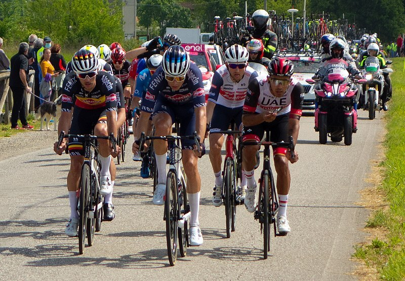

# candle-beit

[Beit](https://arxiv.org/abs/2106.08254) is a computer vision model.
In this example, it is used as an ImageNet classifier: the model returns the
probability for the image to belong to each of the 1000 ImageNet categories.

> candle-beit does not support Metal yet.

## Running on CPU

```bash
$ cargo run --release -- --image ../assets/bike.jpg

Running on CPU, to run on GPU(metal), build this example with `--features metal`
loaded image Tensor[dims 3, 384, 384; f32]
model built
mountain bike, all-terrain bike, off-roader: 56.41%
bicycle-built-for-two, tandem bicycle, tandem: 3.10%
maillot                 : 2.18%
alp                     : 0.89%
crash helmet            : 0.86%
```

## Running on CUDA

```bash
$ cargo run --release --features cuda -- --image ../assets/bike.jpg

loaded image Tensor[dims 3, 384, 384; f32, cuda:0]
model built
mountain bike, all-terrain bike, off-roader: 56.41%
bicycle-built-for-two, tandem bicycle, tandem: 3.10%
maillot                 : 2.18%
alp                     : 0.89%
crash helmet            : 0.86%
```

## Running using Accelerate

```bash
$ cargo run --release --features accelerate -- --image ../assets/bike.jpg

Running on CPU, to run on GPU(metal), build this example with `--features metal`
loaded image Tensor[dims 3, 384, 384; f32]
model built
mountain bike, all-terrain bike, off-roader: 56.41%
bicycle-built-for-two, tandem bicycle, tandem: 3.10%
maillot                 : 2.18%
alp                     : 0.89%
crash helmet            : 0.86%
```



cargo run --release --features metal -- --image ../assets/bike.jpg