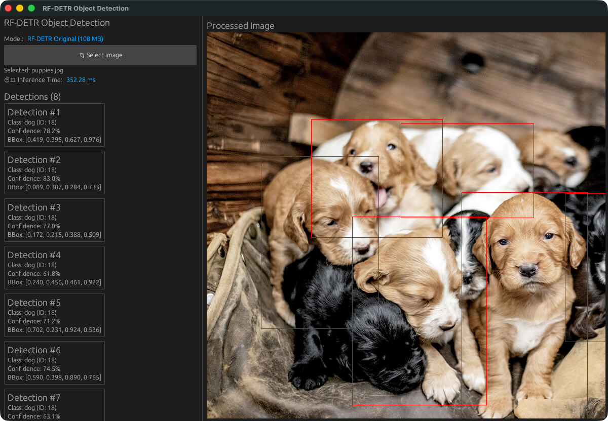
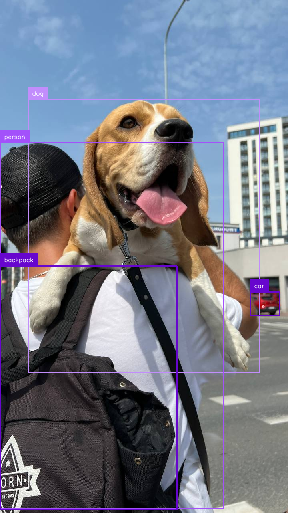
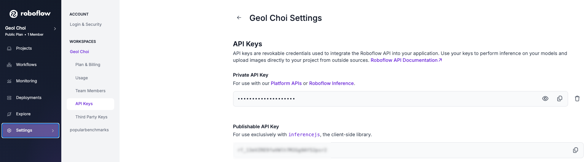

# RF-DETR ONNX

> Original Repo: [https://github.com/cellaxon/rf_detr_onnx_test](https://github.com/cellaxon/rf_detr_onnx_test)

This repository is a Rust implementation of the [RF-DETR](https://github.com/facebookresearch/detr) object detection 
model, which provides a real-time object detection GUI application. The application uses ONNX Runtime to perform object 
detection and provides a simple GUI interface for users to interact with the application..

## Prerequisites

Installing [Just command runner](https://just.systems) is recommended to easily follow the instructions.

## Rust - Inference with Pretrained ONNX Model

### Download the ONNX model to test with

Download one of the ONNX models to test with from the [Hugging Face onnx-community](https://huggingface.co/onnx-community/rfdetr_base-ONNX/tree/main/onnx) repository.

You can download the model directly from [Hugging Face onnx-community](https://huggingface.co/onnx-community/rfdetr_base-ONNX/tree/main/onnx) or run the following command:

```bash
$ just download-model
```

The model will be downloaded to `./assets/models/` directory by running the above command.

### Inference (Running the model in GUI)

```bash
$ cargo run --release
```

The application will start and you can interact with it using the GUI.




## Python - Finetune & Export to ONNX Model

### Python development environment (virtual environment)

```bash
$ just venv
```

### Test inference using Roboflow API (Optional)

Let's check if the ONNX model can be loaded and run using the following command:

```bash
$ just inference-pretrained
```

If ran successfully, the checkpoint file `rf-detr-base.pth` will be downloaded to the current working directory, 
and the following image should be displayed:



### Roboflow API key

We will use Roboflow API to download the dataset from [Roboflow](https://roboflow.com) and finetune the model.

To get the API key, you need to register an account on Roboflow.

You can find the API key from [Settings > Workspaces > API] in Roboflow page.



Before entering the API key, create a `.env` file in the project root directory. Use the following command.

```bash
$ just create-env
```

Enter the Roboflow API key in the `.env` file.

```ini
ROBOFLOW_API_KEY={YOUR-ROBOFLOW-API-KEY}
```

### Download dataset

```bash
$ just donwload-dataset
```

Running the above command will download the dataset from Roboflow. The dataset will be downloaded to the 
`basketball-player-detection-2-13` directory.

### Finetune the model

Let's finetune the model on the Roboflow dataset.

```bash
$ just finetune
```

### Evaluate the model

Let's evaluate the finetuned model on the Roboflow dataset.

```bash
$ just evaluate
```

### Test inference with the finetuned model

```bash
$ just inference-finetuned
```

### Export the model to ONNX

```bash
$ just export-onnx 
```

## Supported Models

- ✅ **Original base model** (`model.onnx`, 108 MB): fastest
- ✅ **FP16 model** (`model_fp16.onnx`, 55.2 MB): reducing memory, but slow
- ❌ **INT8/UINT8 model**: `ConvInteger` NOT supported
- ❌ **4비트 양자화 model**: `MatMulNBits` NOT supported

> **_NOTE_**: Currently, this project is supporting only base model(`rfdetr-base`).
> In the furture, we will support more models.

## Project Structure

```
rf_detr_onnx_test/
├── src/
│   ├── main.rs          # main entry point
│   ├── lib.rs           # core library (ONNX inference, image processing)
│   └── gui.rs           # egui based GUI
├── assets/
│   └── models/
│       └── model.onnx   # RF-DETR onnx model (base model)
├── Cargo.toml
└── README.md
```